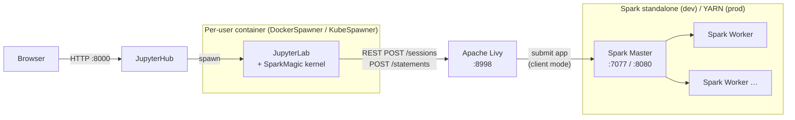
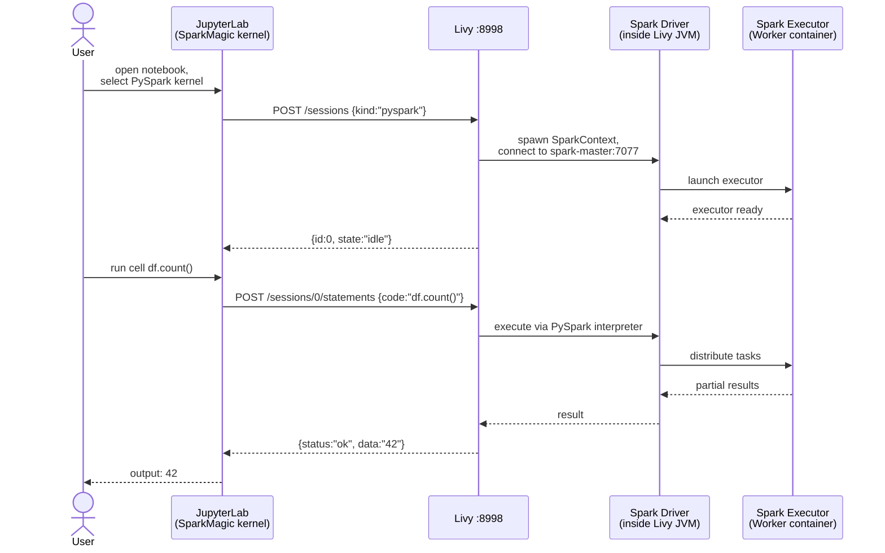
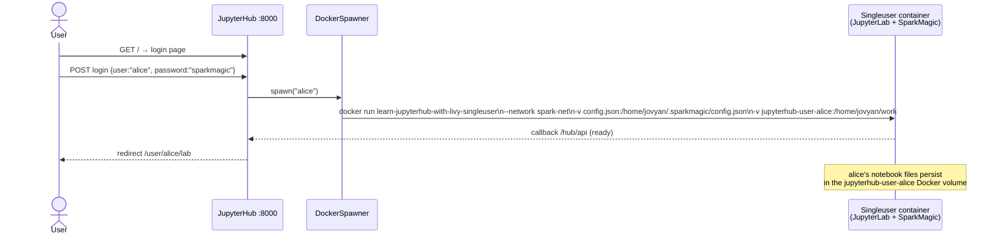

# learn-jupyterhub-with-livy

> Incremental proof-of-concept for migrating data engineers off a shared Jupyter jumpbox onto a
> scalable, multi-user **JupyterHub → SparkMagic → Livy → Spark / YARN** platform.

---

## The Problem

Data engineers share one jumpbox. Every notebook spawns a **local Spark driver** on that machine.
The cluster doesn't scale, resource conflicts are invisible, and environment drift is constant.

| Jumpbox today | Target |
|---|---|
| Local Spark driver on the jumpbox | Driver runs inside Livy on the Hadoop edge node |
| One shared Jupyter process | JupyterHub spawns an isolated container/pod per user |
| Manual `pip install` per user | Immutable, pre-built images — zero user setup |
| No resource governance | YARN queues + K8s resource limits per team |

---

## How the Pieces Fit Together



> **Why is Livy on the edge node, not a K8s pod?**  
> In `yarn-client` mode the Spark driver lives in the Livy JVM. YARN executors must open TCP
> callbacks back to that driver. If Livy is in a K8s overlay network (e.g. `10.244.x.x`) the
> Hadoop NodeManagers can't route to it — sessions hang forever. The edge node is already on the
> Hadoop network, so this is a non-issue.

---

## What Happens When You Run a Notebook Cell



---

## What Happens When a User Logs In (Phase 2+)



---

## Accessing JupyterHub from a Windows RDP Jumpbox

The most common bank pattern: engineers **RDP into a shared Windows jumpbox**, open Chrome or Edge
there, and browse to JupyterHub. JupyterHub runs on the same machine (under WSL2) or a Linux
server reachable from the jumpbox network.

```
Engineer A  ──RDP──► Windows jumpbox  (logged in as BANK\alice)
                          └──► Alice's Chrome  ──► JupyterHub :8000
                                                        └──► jupyter-alice container
                                                                 └──► Livy → Spark

Engineer B  ──RDP──► Windows jumpbox  (logged in as BANK\bob)
                          └──► Bob's Chrome    ──► JupyterHub :8000
                                                        └──► jupyter-bob container
                                                                 └──► Livy → Spark
```

### Why cookies are not shared between engineers

Windows **isolates every RDP session by OS user account**. Browser cookies are stored under each
engineer's Windows user profile:

```
C:\Users\alice\AppData\Local\Google\Chrome\User Data\Default\Cookies
C:\Users\bob\AppData\Local\Google\Chrome\User Data\Default\Cookies
```

These paths are protected by Windows ACLs — `bob` cannot read `alice`'s cookie store.
Each engineer gets their own JupyterHub session token, their own singleuser container, their own
Spark application. The engineers are on the same Windows machine but are fully isolated at the OS
level.

### The only real risk: a shared Windows service account

If every engineer logs into Windows as the same account (`BANK\shared-analyst`), all their cookies
land in one profile and the last login wins. This is:
- a **Windows/AD misconfiguration** — one account per person is mandatory
- an **audit trail violation** under SOX, MiFID II, and most bank security policies

The fix is an AD account per engineer, not a change to JupyterHub.

### Where JupyterHub can run

| Location | Browser URL on jumpbox | Requires |
|---|---|---|
| Same machine as jumpbox (WSL2) | `http://localhost:8000` | Nothing extra |
| Separate Linux server, same LAN | `http://livy-host.bank.internal:8000` | Internal DNS entry |
| Behind nginx with TLS | `https://jupyterhub.bank.internal` | nginx + internal CA cert — see snippet below |

**nginx snippet** (`/etc/nginx/conf.d/jupyterhub.conf` on the Linux server):

```nginx
server {
    listen 443 ssl;
    server_name jupyterhub.bank.internal;

    ssl_certificate     /etc/ssl/certs/hub.crt;   # from internal CA
    ssl_certificate_key /etc/ssl/private/hub.key;

    proxy_set_header Host              $host;
    proxy_set_header X-Real-IP         $remote_addr;
    proxy_set_header X-Forwarded-For   $proxy_add_x_forwarded_for;
    proxy_set_header X-Forwarded-Proto https;

    # WebSocket support (Jupyter terminals, kernel heartbeat)
    proxy_http_version 1.1;
    proxy_set_header Upgrade    $http_upgrade;
    proxy_set_header Connection "upgrade";

    location / {
        proxy_pass http://127.0.0.1:8000;
    }
}
```

Add to `jupyterhub_config.py` when behind nginx:
```python
c.JupyterHub.bind_url = "http://127.0.0.1:8000"   # listen on loopback only
```

### SSH tunnel — only needed if browsing from a personal laptop

SSH tunnels are useful when engineers work from their **own Linux/Mac laptops** and cannot reach
the jumpbox network directly. In the Windows RDP scenario described above, the browser is already
on a machine that can reach JupyterHub — no tunnel required.

```bash
# Only if browsing from a personal laptop without direct network access to JupyterHub
ssh -N -L 8000:localhost:8000 <username>@<jupyterhub-host>
```

---

## Quick Start (Phase 2 — current)

```powershell
# 1. Start everything
docker compose up --build

# 2. Open JupyterHub in your browser
#    http://localhost:8000
#    Log in with any of: alice / bob / data-engineer   (password: sparkmagic)

# 3. Other useful URLs
#    Spark Master UI   http://localhost:8080
#    Livy REST API     http://localhost:8998/sessions
```

Once logged in, open **`shared-notebooks/02_validate_resource_isolation.ipynb`** to verify the
architecture end-to-end, or create a new notebook, select the **PySpark** kernel, and run:

```python
# cell 1 — check connection (no %%magic prefix needed in pysparkkernel)
%%info
```

```python
# cell 2 — first distributed job
sc.parallelize(range(10)).sum()
```

```python
# cell 3 — SQL via SparkSQL
%%sql
SHOW DATABASES
```

### Stop / restart

```powershell
docker compose down          # stop containers (volumes kept)
docker compose down -v       # stop + delete all volumes
docker compose up -d         # start in background (no rebuild)
```

### Scale workers

```powershell
docker compose up --scale spark-worker=3
```

---

## Validating Resource Isolation

The core claim of this architecture is that the **Spark driver lives in Livy (the edge node), not in
the user's container**. Here is how to verify it.

### 1. Open the pre-built validation notebook

Log in to JupyterHub, look in the **`shared-notebooks/`** folder in the left file browser,
and open `02_validate_resource_isolation.ipynb`. Run the cells in order.

| Cell | What it shows |
|---|---|
| `%%info` | Active Livy session ID and state |
| `socket.gethostname()` | Prints the **Livy container hostname** — not the singleuser container |
| `sc.master` | `spark://spark-master:7077` — driver connected to Spark, not running locally |
| `sc.uiWebUrl` | Link to this session's app page on the Spark Master UI |
| executor list | Executors registered on **spark-worker**, not the user container |
| `%%local` Livy REST call | SparkMagic is just an HTTP client — the singleuser container only does REST |
| Monte-Carlo pi | Heavy CPU job — observe `docker stats` to confirm activity is in livy + spark-worker |

### 2. `docker stats` — the side-by-side resource view

While a notebook cell is running, open a second terminal and run:

```powershell
docker stats --no-stream
```

Expected output during a running job:

```
NAME                                    CPU %   MEM USAGE
learn-jupyterhub-with-livy-spark-worker  ~80%   ~800MiB   ← executors here
learn-jupyterhub-with-livy-livy          ~20%   ~400MiB   ← Spark driver here
jupyter-alice                             ~0%    ~150MiB   ← just an HTTP client
learn-jupyterhub-with-livy-jupyterhub     ~0%    ~100MiB   ← hub idle
```

The singleuser container stays near-idle regardless of job size — this is the resource win.

### 3. Spark Master UI — http://localhost:8080

- **Workers tab**: shows registered workers and total capacity.
- **Running Applications**: each Livy session appears as an application.
  - Click an application → **Executors tab** → shows which worker host each executor runs on.
  - **Stages tab** → task-level parallelism and shuffle bytes.

### 4. Livy REST API — http://localhost:8998

```powershell
# all active sessions
curl http://localhost:8998/sessions

# statements run in session 0
curl http://localhost:8998/sessions/0/statements

# logs for session 0 (includes driver stdout / PySpark errors)
curl http://localhost:8998/sessions/0/log
```

### 5. What the edge-node emulation looks like here vs production

| Aspect | This Docker Compose stack | Production (YARN) |
|---|---|---|
| Edge node role | `livy` container | Physical Hadoop edge node server |
| Driver location | Inside `livy` container JVM | Inside Livy JVM on edge node |
| Executor location | `spark-worker` container | YARN NodeManagers across the cluster |
| User container | `jupyter-{username}` Docker container | Kubernetes pod (KubeSpawner) |
| Network path | Docker bridge `spark-net` | Edge node is on the Hadoop network |
| Driver → executor callbacks | Docker DNS (works trivially) | Must work; edge node has routable IP on HDFS network |

The Docker Compose topology faithfully mirrors the production topology — Livy is as close as the
edge node gets to the executors, and the user's container never touches the Spark wire protocol.

---

## Repository Layout

```
learn-jupyterhub-with-livy/
│
├── docker-compose.yml              # All services — see Phase column below
│
├── docker/
│   ├── livy/
│   │   └── Dockerfile              # Livy 0.9.0 built on apache/spark:3.5.3
│   ├── jupyterhub/
│   │   └── Dockerfile              # JupyterHub 4.1.6 + dockerspawner + dummyauthenticator
│   ├── singleuser/
│   │   └── Dockerfile              # Per-user JupyterLab + SparkMagic (spawned by hub)
│   └── jupyter/                    # Phase 1 only — single shared notebook server
│       └── Dockerfile
│
├── config/
│   ├── livy/
│   │   ├── livy.conf               # Spark master URL, auth, session limits
│   │   └── livy-env.sh             # SPARK_HOME, JVM heap, HADOOP_CONF_DIR
│   ├── jupyterhub/
│   │   └── jupyterhub_config.py    # DockerSpawner, allowed users, volume mounts
│   └── sparkmagic/
│       ├── config.json             # Livy URL, auth mode, executor sizing
│       └── README.md               # Field-by-field explanation of config.json
│
└── notebooks/
    └── 01_test_connection.ipynb    # Phase 1/2 validation notebook
```

---

## Phase Roadmap

| Phase | Status | What it adds |
|---|---|---|
| **1** — Core chain | ✅ done | `spark-master`, `spark-worker`, `livy`, single `jupyter` |
| **2** — JupyterHub | ✅ done | `jupyterhub` + DockerSpawner; per-user containers + volumes |
| **3** — Kerberos | ⬜ next | MIT KDC container; SPNEGO on Livy; `kinit`-renewer sidecar |
| **4** — Hive Metastore | ⬜ | HMS container; `spark.sql.catalog` config; `%%sql SHOW TABLES` |
| **5** — kind + KubeSpawner | ⬜ | K8s-in-Docker; Z2JH Helm chart; SparkMagic as ConfigMap |
| **6** — Production docs | ⬜ | Architecture doc; production checklist; values for on-prem |

---

## Key Config Knobs

### Who can log in — `config/jupyterhub/jupyterhub_config.py`

```python
c.Authenticator.allowed_users = {"alice", "bob", "data-engineer"}
c.DummyAuthenticator.password = "sparkmagic"   # shared password (dev only)
```

**Phase 3:** replace `"dummy"` with `"pam"` or `"ldap"` and remove `DummyAuthenticator`.

### Livy connection — `config/sparkmagic/config.json`

```jsonc
"url": "http://livy:8998",       // Docker service name; change to edge-node hostname in prod
"auth": "None",                   // Phase 3: "Kerberos"
"numExecutors": 1,                // raise for parallel workloads
"executorMemory": "1G"            // must be ≤ SPARK_WORKER_MEMORY in docker-compose.yml
```

### Spark worker resources — `docker-compose.yml`

```yaml
SPARK_WORKER_MEMORY: "2G"
SPARK_WORKER_CORES: "2"
```

### Per-user container limits — `jupyterhub_config.py`

```python
c.DockerSpawner.mem_limit = "2G"
c.DockerSpawner.cpu_limit = 2
```

---

## Version Matrix

| Component | Version |
|---|---|
| Apache Spark | 3.5.3 (`apache/spark:3.5.3`) |
| Apache Livy | 0.9.0-incubating |
| SparkMagic | 0.23.0 |
| JupyterHub | 4.1.6 |
| Jupyter singleuser base | `pyspark-notebook:spark-3.5.3` |
| dockerspawner | 13.0.0 |

---

## Gotchas

1. **`pysparkkernel` — no `%%pyspark` prefix.**  
   Every cell is already PySpark. Only special magics are `%%info`, `%%sql`, `%%local`, `%manage_spark`.

2. **`auth` in `config.json` is case-sensitive.**  
   Must be exactly `"None"`, `"Basic_Access"`, or `"Kerberos"`.

3. **Livy 0.9 — never set `auth.type = none`.**  
   That now requires an extra class property. Leave `livy.server.auth.type` commented out entirely to skip auth.

4. **`apache/spark` image has no `python` binary.**  
   Both the Livy container (driver) and spark-worker (executor) need `python` in PATH.
   Fixed by `ln -s /usr/bin/python3 /usr/bin/python` in the Livy Dockerfile and the worker's entrypoint.

5. **DockerSpawner volume paths are HOST paths.**  
   The left side of every entry in `c.DockerSpawner.volumes` is evaluated on the Docker host, not inside the hub container. `REPO_ROOT` is mapped in `docker-compose.yml` to bridge this.

6. **Kerberos TGTs expire (typically 10 h).**  
   Long-running notebook sessions need a `kinit -R` renewer sidecar — Phase 3 adds this.

7. **YARN executor → driver callback.**  
   In `yarn-client` mode, Livy must be on the Hadoop network (edge node), not behind a K8s overlay, so executors can phone home to the driver.

8. **Cookie isolation on a shared Windows jumpbox is handled by Windows, not JupyterHub.**  
   Each engineer RDPs with their own AD account (`BANK\alice`, `BANK\bob`).  
   Windows stores browser cookies under `C:\Users\<username>\AppData\...` — isolated by OS ACLs.  
   The risk is a **shared service account** on the jumpbox (everyone logs in as the same Windows
   user). That is a Windows/AD misconfiguration and an audit violation, not a JupyterHub problem.

9. **Editing `config.json` or notebooks on the host takes effect immediately on next server start.**  
   The files are bind-mounted read-only into each singleuser container — Docker overlays the live
   host files on top of the image copy. Stop and restart the user server (hub → Control Panel →
   Stop My Server → Start My Server) to pick up changes.  
   If `REPO_ROOT` is not set correctly, the image-baked copies serve as fallback.

| Current (jumpbox) | Target architecture |
|---|---|
| Spark driver runs locally on the jumpbox — doesn't scale | Spark driver runs remotely inside Livy on a cluster edge node |
| Each user opens a separate Jupyter server process | JupyterHub spawns isolated per-user pods/containers |
| Manual environment setup per user | Declarative, pre-built images; zero user setup |
| No resource governance | YARN queues + Kubernetes resource limits per team |

---

## Target Architecture

```
Browser
  └─► JupyterHub  (Kubernetes, Zero-to-JupyterHub Helm chart)
        └─► KubeSpawner → User Pod  (SparkMagic + kinit sidecar)
                └─► HTTPS/SPNEGO ──► Apache Livy  (Hadoop edge node)
                                          └─► YARN → Spark executors
                                                         └─► HDFS / Hive
```

> **Why Livy on the edge node (not a K8s pod)?**  
> In `yarn-client` deploy mode the Spark driver lives inside the Livy JVM. YARN executors must open
> TCP callbacks to that driver. If Livy runs in a K8s overlay network (e.g. Flannel `10.244.x.x`),
> Hadoop NodeManagers on a separate network cannot route to the driver — sessions hang and die.
> The edge node is already on the Hadoop network, so callbacks work natively.

---

## Exploration Roadmap

### Track A — Docker Compose + DockerSpawner
*One `docker-compose.yml` grown incrementally. Each phase adds services, never replaces them.*

| Phase | Focus | New services / files |
|---|---|---|
| **1** ✅ | Core chain (no auth) | `spark-master`, `spark-worker`, `livy`, `jupyter` |
| **2** | JupyterHub + DockerSpawner | Replace `jupyter` with `jupyterhub`; `Dockerfile.jupyter-user`; `jupyterhub_config.py` |
| **3** | Kerberos + SPNEGO | Add `krb5-kdc`; `livy-kerberos.conf`; `kinit-renewer.sh` |
| **4** | Hive Metastore | Add `hive-metastore`; update `session_configs` with `hive.metastore.uris` |

### Track B — kind (Kubernetes) + KubeSpawner
*Livy + Spark + KDC + HMS still run in Docker Compose. Only the spawner is replaced.*

| Phase | Focus | New files |
|---|---|---|
| **5** | KubeSpawner on kind | `kind-config.yaml`; `helm/values-local-kind.yaml`; `k8s/configmap-sparkmagic.yaml` |
| **6** | Production design | `docs/architecture.md`; `helm/values-prod.yaml`; `docs/production-checklist.md` |

---

## Prerequisites

| Tool | Version | Notes |
|---|---|---|
| Docker Desktop | ≥ 4.28 | With Linux containers mode |
| Docker Compose | v2 (`docker compose`) | Bundled with Docker Desktop |
| `kind` | ≥ 0.23 | Phase 5 only — `choco install kind` or https://kind.sigs.k8s.io |
| `helm` | ≥ 3.5 | Phase 5 only — `choco install kubernetes-helm` |
| `kubectl` | ≥ 1.32 | Phase 5 only — bundled with Docker Desktop |

---

## Phase 1 — Quick Start

```powershell
cd c:\Users\sofiane\work\learn-jupyterhub-with-livy

# Build images and start all services
docker compose up --build

# Watch for Livy healthcheck to pass (takes ~30s)
# Then open:
#   Jupyter Lab   http://localhost:8888  (token: sparkmagic)
#   Spark UI      http://localhost:8080
#   Livy REST     http://localhost:8998/sessions
```

Open `notebooks/01_test_connection.ipynb` in Jupyter Lab and run through the cells.

### Shut down

```powershell
docker compose down          # stop and remove containers
docker compose down -v       # also remove volumes
```

### Scale workers

```powershell
docker compose up --scale spark-worker=3
```

---

## Repository Structure

```
learn-jupyterhub-with-livy/
│
├── docker-compose.yml              # Phase 1: spark-master, spark-worker, livy, jupyter
│
├── docker/
│   ├── livy/
│   │   └── Dockerfile              # Livy 0.9.0-incubating built on bitnami/spark:3.5
│   └── jupyter/
│       └── Dockerfile              # quay.io/jupyter/pyspark-notebook + sparkmagic==0.23.0
│
├── config/
│   ├── livy/
│   │   ├── livy.conf               # Livy server config (spark master URL, auth, session limits)
│   │   └── livy-env.sh             # SPARK_HOME and HADOOP_CONF_DIR env vars for Livy
│   └── sparkmagic/
│       └── config.json             # SparkMagic: Livy URL, auth mode, session defaults
│
└── notebooks/
    └── 01_test_connection.ipynb    # Phase 1 validation: %%info, %%pyspark, %%sql
```

---

## Verification Checklist

### Phase 1
- [ ] `curl http://localhost:8998/sessions` returns `{"from":0,"total":0,"sessions":[]}`
- [ ] `curl http://localhost:8998/version` returns Livy version JSON
- [ ] Jupyter Lab opens at `http://localhost:8888` with token `sparkmagic`
- [ ] `%%info` in notebook returns a Livy session ID and Spark version (3.5.x)
- [ ] `%%pyspark` cell `sc.version` returns without error
- [ ] `%%sql SHOW DATABASES` returns at least `default`

---

## Key Configuration Files

### `config/sparkmagic/config.json`
Controls how SparkMagic connects to Livy. Key fields:

| Field | Phase 1 value | Phase 3 value |
|---|---|---|
| `kernel_python_credentials.url` | `http://livy:8998` | `http://livy:8998` |
| `kernel_python_credentials.auth` | `"None"` | `"Kerberos"` |
| `session_configs.driverMemory` | `"1G"` | `"1G"` |
| `session_configs.numExecutors` | `1` | `1` |

### `config/livy/livy.conf`
Controls the Livy server. Key fields:

| Field | Phase 1 value | Phase 3 value |
|---|---|---|
| `livy.server.auth.type` | `none` | `kerberos` |
| `livy.spark.master` | `spark://spark-master:7077` | `yarn` (when on real cluster) |
| `livy.impersonation.enabled` | `false` | `true` |

---

## Version Matrix

| Component | Version | Notes |
|---|---|---|
| Apache Spark | 3.5 (bitnami/spark:3.5) | Standalone for local; YARN on cluster |
| Apache Livy | 0.9.0-incubating | Latest stable (Feb 2026); requires Spark 3.0+ |
| SparkMagic | 0.23.0 | Latest stable (Jul 2025) |
| Jupyter base image | pyspark-notebook:spark-3.5.3 | Quay.io Jupyter project |
| JupyterHub Helm (Phase 5) | 5.x (Zero-to-JupyterHub) | Requires K8s ≥ 1.32 |
| kind (Phase 5) | ≥ 0.23 | K8s-in-Docker; no WSL2 needed on Windows |

---

## Known Gotchas

1. **Livy is still in Apache Incubator** after 9 years — infrequent releases. Consider [Lighter](https://github.com/exacaster/lighter) as a drop-in alternative for production.
2. **`auth` values in `config.json` are case-sensitive**: must be exactly `"None"`, `"Basic_Access"`, or `"Kerberos"`.
3. **Kerberos TGTs expire** (typically 10h). Long-running Jupyter sessions need a `kinit -R` sidecar — covered in Phase 3.
4. **`proxyUser` requires Hadoop admin** to add `hadoop.proxyuser.livy.*` entries to `core-site.xml` on every NameNode and ResourceManager.
5. **Livy 0.9 requires Spark 3.0+** — verify the client cluster's Spark version before deploying.
6. **YARN executor → Livy callback**: put Livy on the edge node, not a K8s pod, to avoid overlay network routing issues.
7. **`readOnly: true` on ConfigMap mounts** prevents SparkMagic's GUI widget from saving session changes — this is fine for production config delivery.
